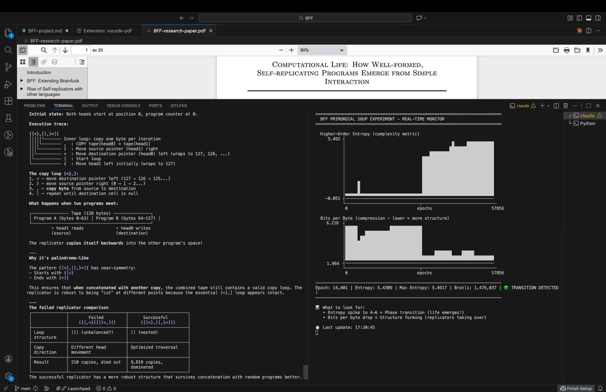

# BFF Primordial Soup

A simple and basic (Numba-accelerated) Python implementation of the BFF (Brainfuck variant) primordial soup experiment from ["Computational Life: How Well-formed, Self-replicating Programs Emerge from Simple Interaction"](https://arxiv.org/abs/2406.19108) by Blaise Agüera y Arcas et al.

This demonstrates how **self-replicating programs can emerge spontaneously** from random programs through self-modification — no fitness function, no selection pressure, just random interactions.



## How It Works

1. Start with a "soup" of random 64-byte programs with completely randomized byte values (only 10 of which correspond to actual brainfuck instructions, meaning only about ~4% of cells will actually have any type of instruction at all in them and, the rest are jsut no-ops)
2. Each epoch: shuffle the programs, pair them up, concatenate into 128-byte tapes
3. Execute the BFF interpreter on each tape (programs can modify themselves and each other)
4. Split tapes back into programs
5. Repeat — eventually, self-replicators emerge and take over the soup

The **phase transition** is detected when higher-order entropy spikes above 3.0, indicating structured replicators have emerged from random noise.

**No mutation:** This Python implementation deliberately uses no external mutation. Programs only change through self-modification during BFF execution. This demonstrates the paper's key insight — self-replicators can emerge purely from program interactions without any external randomness or mutation pressure.

## Files

| File | Description |
|------|-------------|
| `bff_soup.py` | Numba-accelerated simulation (~70x faster than pure Python) |
| `bff_analysis.py` | Checkpoint save/load and replicator extraction tools |
| `visualize_bff.py` | Real-time ASCII visualization of entropy and compression |

## Quick Start

### Running the Simulation

This is the Numba-accelerated version (~70x faster than pure Python, ~2x faster than PyPy).

```bash
# Install dependencies
pip install numba numpy

# Run simulation with 131k programs (as used in the paper)
# Runs at ~1 epoch/sec on M2 MacBook Air, transition typically occurs around epoch 12-16k
# Expect ~4-5 hours to transition
python3 bff_soup.py --num 131072 --epochs 20000

# In a separate terminal, watch the progress (always stored in bff_soup.log unless specified differently on start of bff_soup.py)
python3 visualize_bff.py bff_soup.log

# Zoom in on last 500 epochs to see transition detail E.g.
python3 visualize_bff.py bff_soup.log --last 500
```

### Command-line Options

```
--num N              Number of programs in soup (default: 1024)
--epochs N           Maximum epochs to run (default: 10000)
--seed N             Random seed (default: 42)
--log FILE           Log file path (default: bff_soup.log, use '' to disable)
--checkpoint-dir DIR Checkpoint directory (default: checkpoints/, use '' to disable)
--checkpoint-interval N  Save checkpoint every N epochs (default: 256)
--resume FILE        Resume simulation from checkpoint file
```

### Resuming from Checkpoint

If a run is interrupted or you want to extend it, resume from the latest checkpoint:

```bash
# Find the latest checkpoint (using the .dat file for that specific run)
ls -t checkpoints/*.dat | head -1

# Resume and run to 50000 epochs (using the .dat file for that specific run)
python3 bff_soup.py --resume checkpoints/0000010240.dat --epochs 50000
```

### Analyzing Results

# After a run (or during), examine emergent replicators: (with the .dat file for that specific run)

```bash
python3 bff_analysis.py checkpoints/0000001024.dat --top 10
```

## Running with cubff (C++ Implementation)

For serious experiments, the [cubff](https://github.com/paradigms-of-intelligence/cubff) C++ implementation is ~15-30x faster:

```bash
# Clone and build
git clone https://github.com/paradigms-of-intelligence/cubff.git
cd cubff && mkdir build && cd build
cmake .. -DCUDA=OFF
make -j$(nproc)

# Run (outputs to stdout in CSV format)
./main --lang bff_noheads --soup-size 1024 --print-interval 64 > ../bff_run.log &

# Use the same visualizer
cd ..
python3 visualize_bff.py bff_run.log
```

## What to Look For

In the visualizer:
- **🔴 Pre-life**: Entropy near 0, random noise
- **🟡 Evolving**: Entropy 1-3, structure forming
- **🟢 TRANSITION**: Entropy spikes to 4-6, replicators have emerged!

A successful transition typically shows:
- Sudden entropy spike
- Compression ratio drops (more structure = more compressible)
- Operations per pair jumps from hundreds to thousands

## References

- Paper: [arXiv:2406.19108](https://arxiv.org/abs/2406.19108)
- Original implementation: [github.com/paradigms-of-intelligence/cubff](https://github.com/paradigms-of-intelligence/cubff)
- Sean Carroll interview: [Mindscape Podcast](https://www.preposterousuniverse.com/podcast/2024/07/22/283-blaise-aguera-y-arcas-on-the-emergence-of-replication-and-computation/)
